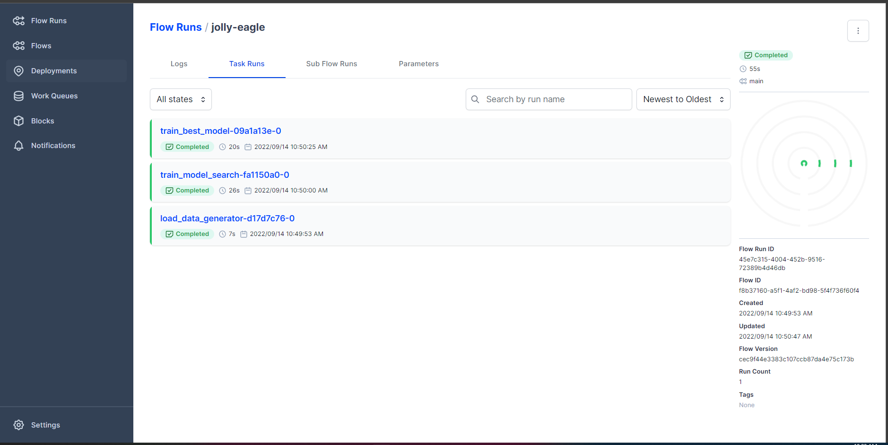

## 4. Pipeline Orchestration 

One definition of an ML pipeline is a means of automating the machine learning workflow by enabling data to be transformed and correlated into a model that can then be analyzed to achieve outputs. This type of ML pipeline makes the process of inputting data into the ML model fully automated. 

Another type of ML pipeline is the art of splitting up your machine learning workflows into independent, reusable, modular parts that can then be pipelined together to create models. This type of ML pipeline makes building models more efficient and simplified, cutting out redundant work.

This goes hand-in-hand with the recent push for microservices architectures, branching off the main idea that by splitting your application into basic and siloed parts you can build more powerful software over time. In this part we will use [prefect.io](https://www.prefect.io/) pipeline orchestration. 

References 

- [What a Machine Learning Pipeline is and why it’s important](https://www.datarobot.com/blog/what-a-machine-learning-pipeline-is-and-why-its-important/)
- [prefect.io docs](https://docs.prefect.io/) 

