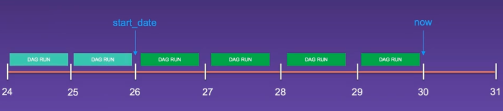

```bash
brew install astro
astro dev init

# check astro airflow running or not
astro dev ps
# start the astro
astro dev start
astro dev stop.


```

###  Attach Remote Running Container
1. Install remote Container Extension
2. Open a Remote Window or `Control + Ship +P` 
3. Attach to Running Container -> Choose `airflow_scheduler`
4. Open folder in this direction `/usr/local/airflow/`


### Shortcut
shift + \


## Scheduler
### Scheduler expression
```bash
None          Don’t schedule, use for exclusively “externally triggered” DAGs
@once          Schedule once and only once
@hourly          Run once an hour at the end of the hour
@daily          Run once a day at midnight (24:00)
@weekly          Run once a week at midnight (24:00) on Sunday
@monthly          Run once a month at midnight (24:00) of the first day of the month
@quarterly        Run once a quarter at midnight (24:00) on the first day
@yearly          Run once a year at midnight (24:00) of January 1
```

If you want to run your task every 3 days or every 3 week, please use CRON expressions
```bash
from datetime import timedelta

schedule = timedelta(weeks=2),
```


#### The catchup and backfilling
The catchup mechanism in Airflow allows running all non-triggered DAGRuns between the start date and the last time the DAG was triggered. The backfilling mechanism allows running historical DAGRuns or rerun already existing DAGRuns.

```bash
airflow dags backfill --start-date START_DATE --end-date END_DATE dag_id
```

#### XCOM
SQLite -> 2Gb per XCOM
Postgres -> 1Gb per XCOM
MySQL -> 64MB per XCOM


https://registry.astronomer.io/