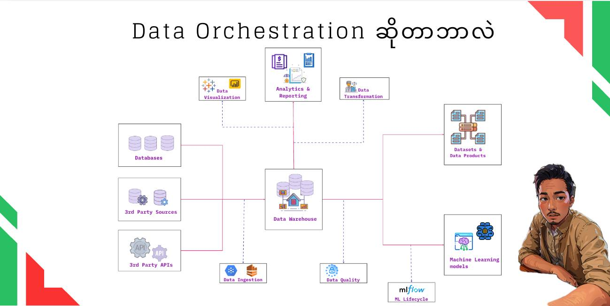

### ဘာလို့ 𝗗𝗮𝘁𝗮 𝗢𝗿𝗰𝗵𝗲𝘀𝘁𝗿𝗮𝘁𝗶𝗼𝗻 လိုအပ်တာလဲ?
အစရှိတဲ့ မေးခွန်းတွေ ဖြေဖို့အတွက်ဆိုရင် ကျွန်တော်တို့တွေ အရင်ခေတ်က 𝐝𝐚𝐭𝐚 𝐬𝐲𝐬𝐭𝐞𝐦 တွေနဲ့ ဒီဘက်ခေတ် 𝐝𝐚𝐭𝐚 𝐬𝐲𝐬𝐭𝐞𝐦 တွေကိုယှဉ်ကြည့်ဖို့လိုပါမယ်။

အကြမ်းဖျင်းအားဖြင့် အရင်ခေတ်ကဆိုရင် 𝐂𝐨𝐦𝐩𝐚𝐧𝐲 တွေမှာက 𝐝𝐚𝐭𝐚 တွေကို 𝐝𝐚𝐭𝐚𝐛𝐚𝐬𝐞 ထဲပဲသိမ်းထားပီး 𝐝𝐞𝐯𝐞𝐥𝐨𝐩𝐞𝐫𝐬 တွေနဲ့ 𝐏𝐥𝐚𝐧𝐧𝐢𝐧𝐠 𝐚𝐧𝐝 𝐥𝐨𝐠𝐢𝐬𝐭𝐢𝐜𝐬 𝐝𝐞𝐩𝐚𝐫𝐭𝐦𝐞𝐧𝐭 လောက်ပဲအသုံးပြုကြပါတယ်။ဒါပေမဲ့ ဒီဘက်ခေတ်မှာတော့ 𝐂𝐨𝐦𝐩𝐚𝐧𝐲 တော်တော်များများမှာ 𝐝𝐚𝐭𝐚 ကိုအသုံးပြုတဲ့ 𝐝𝐚𝐭𝐚 𝐜𝐨𝐧𝐬𝐮𝐦𝐞𝐫𝐬 တွေများလာတဲ့အတွက် 𝐝𝐚𝐭𝐚 𝐰𝐚𝐫𝐞𝐡𝐨𝐮𝐬𝐞 တစ်ခုခုထဲထည့်ပီး မျိုးစုံအသုံးပြုလာကြပါတယ်။

ဉပမာအနေနဲ့ အခုကျွန်တော် အောက်ပုံမှာပြထားတဲ့ 𝐭𝐲𝐩𝐢𝐜𝐚𝐥 𝐝𝐚𝐭𝐚 𝐝𝐫𝐢𝐯𝐞𝐧 𝐬𝐲𝐬𝐭𝐞𝐦 တစ်ခုဆိုပါတော့။

ကျွန်တော်တို့တွေမှာ 𝐝𝐚𝐭𝐚 𝐜𝐨𝐧𝐬𝐮𝐦𝐞𝐫𝐬 တွေအများကြီးရှိနိုင်ပါတယ်။

𝐏𝐥𝐚𝐧𝐧𝐢𝐧𝐠 𝐚𝐧𝐝 𝐥𝐨𝐠𝐢𝐬𝐭𝐢𝐜𝐬 𝐝𝐞𝐩𝐚𝐫𝐭𝐦𝐞𝐧𝐭 က 𝗱𝗮𝘁𝗮 𝗮𝗻𝗮𝗹𝘆𝘀𝘁 တွေလည်း 𝐫𝐞𝐚𝐥-𝐭𝐢𝐦𝐞 𝐢𝐧𝐭𝐞𝐫𝐚𝐜𝐭𝐢𝐯𝐞 𝐝𝐚𝐭𝐚 𝐝𝐚𝐬𝐡𝐛𝐨𝐚𝐫𝐝 တွေအတွက်အသုံးပြုချင်တယ်။

𝐄𝐧𝐠𝐢𝐧𝐞𝐞𝐫𝐢𝐧𝐠 𝐝𝐞𝐩𝐚𝐫𝐭𝐦𝐞𝐧𝐭 က 𝐝𝐚𝐭𝐚 𝐞𝐧𝐠𝐢𝐧𝐞𝐞𝐫 တွေကလည်း 𝐫𝐚𝐰 ဝင်လာတဲ့ 𝐝𝐚𝐭𝐚 တွေကနေ 𝐧𝐞𝐰 𝐝𝐚𝐭𝐚𝐬𝐞𝐭𝐬 တွေ 𝐜𝐫𝐞𝐚𝐭𝐞 လုပ်ချင်တယ်၊ နောက် 𝐝𝐚𝐭𝐚 𝐬𝐜𝐢𝐞𝐧𝐭𝐢𝐬𝐭𝐬 တွေကလည်း တကယ့် 𝐩𝐫𝐨𝐝𝐮𝐜𝐭𝐢𝐨𝐧 𝐝𝐚𝐭𝐚 တွေသုံးပီး 𝐦𝐚𝐜𝐡𝐢𝐧𝐞 𝐥𝐞𝐚𝐫𝐧𝐢𝐧𝐠 𝐦𝐨𝐝𝐞𝐥 တွေ၊ 𝐝𝐞𝐞𝐩 𝐥𝐞𝐚𝐫𝐧𝐢𝐧𝐠 𝐦𝐨𝐝𝐞𝐥 တွေ 𝐜𝐫𝐞𝐚𝐭𝐞 လုပ်ချင်တယ်၊

နောက်ပီး 𝐌𝐋𝐎𝐩𝐬 𝐄𝐧𝐠𝐢𝐧𝐞𝐞𝐫𝐬 တွေကလည်း 𝐝𝐚𝐭𝐚 𝐬𝐜𝐢𝐞𝐧𝐭𝐢𝐬𝐭𝐬တွေ 𝐝𝐞𝐯𝐞𝐥𝐨𝐩𝐞𝐝 လုပ်ထားတဲ့ 𝐦𝐨𝐝𝐞𝐥 တွေကို 𝐝𝐞𝐩𝐥𝐨𝐲 လုပ်ပီး၊ 𝐏𝐫𝐨𝐝𝐮𝐜𝐭𝐢𝐨𝐧 𝐭𝐫𝐚𝐟𝐟𝐢𝐜 နဲ့ စမ်းကြည့်ချင်တယ်။

နောက်ပီး 𝐃𝐞𝐯𝐞𝐥𝐨𝐩𝐞𝐫 𝐓𝐞𝐚𝐦 က 𝐃𝐞𝐯𝐞𝐥𝐨𝐩𝐞𝐫𝐬 တွေကလည်း သူတို့ 𝐀𝐩𝐩 နဲ့ အဆင်ပြေမယ် 𝐝𝐚𝐭𝐚 တွေကိုတန်းပီးသုံးချင်တယ်။

ပုံမှာဆိုရင် 𝐝𝐚𝐭𝐚 𝐜𝐨𝐧𝐬𝐮𝐦𝐞𝐫𝐬 တွေအသုံးပြုချင်တဲ့ 𝐝𝐚𝐭𝐚 တွေအကုန်ရှိနေတာက အလယ်က 𝐝𝐚𝐭𝐚 𝐰𝐚𝐫𝐞𝐡𝐨𝐮𝐬𝐞 ထဲမှာရှိတယ်။အသုံးပြုမယ့်ပုံစံ၊ လိုအပ်နေတဲ့ 𝗳𝗼𝗿𝗺𝗮𝘁 ၊ လိုချင်တဲ့ 𝐫𝐞𝐚𝐝/𝐰𝐫𝐢𝐭𝐞 𝐬𝐩𝐞𝐞𝐝 သာမတူညီကြတာပေါ့။ ဒီလို 𝐝𝐚𝐭𝐚 𝐜𝐨𝐧𝐬𝐮𝐦𝐞𝐫𝐬 များတဲ့ 𝐎𝐫𝐠𝐚𝐧𝐢𝐳𝐚𝐭𝐢𝐨𝐧 မှာဆိုရင် 𝐃𝐚𝐭𝐚 𝐎𝐫𝐜𝐡𝐞𝐬𝐭𝐫𝐚𝐭𝐢𝐨𝐧 ကသေချာပေါက်လိုအပ်လာပီ။

နောက်ပီး အဲ့ထဲကို ရောက်အောင် ပို့ပေးနေတဲ့ 𝐝𝐚𝐭𝐚 𝐬𝐨𝐮𝐫𝐜𝐞𝐬 တွေ 𝟑 ခုရှိတယ်။ အဲ့ 𝟑 ခုက 𝐫𝐚𝐰 𝐝𝐚𝐭𝐚 တွေပါလာတာမျိုး၊ 𝐜𝐥𝐞𝐚𝐧 လုပ်ဖို့လိုအပ်နေသေးတာမျိုးတွေ ရှိနိုင်သေးတယ်။
ဒါတွေကို 𝐭𝐨𝐨𝐥𝐬 တစ်ခုခုအသုံးပြုပီး ဖြေရှင်းတာကို 𝐃𝐚𝐭𝐚 𝐎𝐫𝐜𝐡𝐞𝐬𝐭𝐫𝐚𝐭𝐢𝐨𝐧 လုပ်တယ်လို့အကြမ်းဖျင်းမှတ်လို့ရပါတယ်။

ဆိုတော့က 𝐃𝐚𝐭𝐚 𝐎𝐫𝐜𝐡𝐞𝐬𝐭𝐫𝐚𝐭𝐢𝐨𝐧 ဆိုတာကို 𝐝𝐞𝐟𝐢𝐧𝐢𝐭𝐢𝐨𝐧 ပြန်ဖွင့်ရင် “မိမိလိုချင်တဲ့ 𝐝𝐚𝐭𝐚 𝐛𝐞𝐧𝐞𝐟𝐢𝐭𝐬 အတွက် 𝐝𝐚𝐭𝐚 ကို သူ့တန်ဖိုး မပျက်စေပဲ တစ်ဆင့် (သို့) အဆင့်ဆင့် ပြုပြင်ပြောင်းလဲခြင်း ” ဆိုပီးမှတ်ယူလို့ရပါတယ်။

ဒီလောက်ဆိုရင် 𝐃𝐚𝐭𝐚 𝐎𝐫𝐜𝐡𝐞𝐬𝐭𝐫𝐚𝐭𝐢𝐨𝐧 အကြောင်းနည်းနည်းရမယ်လို့ထင်ပါတယ်။ 𝐃𝐚𝐭𝐚 𝐎𝐫𝐜𝐡𝐞𝐬𝐭𝐫𝐚𝐭𝐢𝐨𝐧 နဲ့ပတ်သက်လာရင် နာမည်ကြီးတဲ့ 𝑇𝑜𝑜𝑙𝑠 တွေအများကြီးရှိပါတယ်။ 𝐃𝐚𝐭𝐚 𝐃𝐫𝐢𝐯𝐞𝐧 𝐂𝐚𝐫𝐞𝐞𝐫 လုပ်တဲ့လူတွေကြားမှာ နာမည်ကြီးတာတွေကတော့
  𝟏. 𝐃𝐚𝐭𝐚b𝐫𝐢𝐜𝐤𝐬
  𝟐. 𝐀𝐢𝐫𝐟𝐥𝐨𝐰
  𝟑. 𝐃𝐚𝐭𝐚 𝐅𝐚𝐜𝐭𝐨𝐫𝐲
  𝟒. 𝐏𝐫𝐞𝐟𝐞𝐜𝐭.𝐢𝐨
  𝟓. 𝐊𝐮𝐛𝐞𝐟𝐥𝐨𝐰

### Prefect vs Airflow vs Databricks

| Case |Prefect | Airflow | Databricks |
|---------|---------|---------|---------|
|Ease of Use | UI is straightforward, with deployment a breeze using API-based objects |  UI is minimalistic, with deployment focusing on operators and DAG construction | - |
|Scalability | Highly scalable and can be incorporated into Prefect Cloud | Requires scaling of hardware | - |
| Flexibility | Very flexible due to its blocks integrating with other data sources | Operators offer abstractions that allow for easy connections to other data sources| - | 
| Monitoring and Logging | Modern, dynamic event-management | Logging must be constructed manually |- |
| Community and Support | Newer and less community support |Older, lots of community support and development |- |

