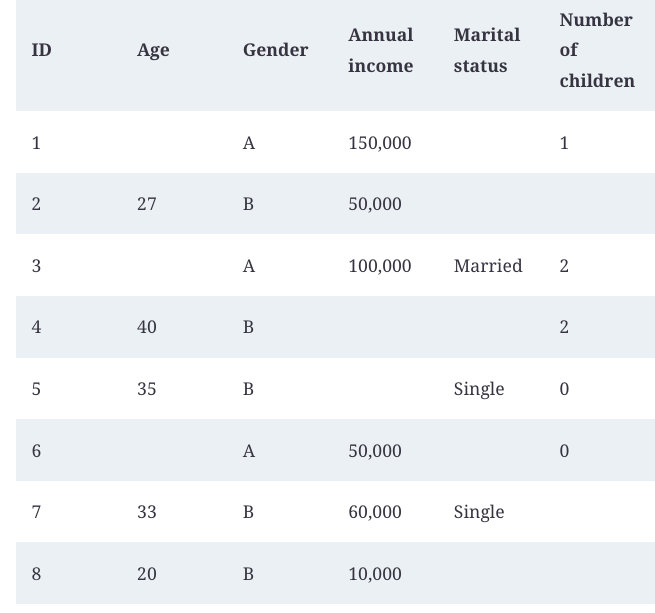

### 1. Frame to Machine Learning Problems

Developing an ML system is an iterative and, in most cases, never-ending process. Once a system is put into production, it’ll need to be continually monitored and updated.

#### ML System approach steps
1. Project Scoping
2. Data engineering
3. ML model Development
4. Deployment
5. Monitoring and continual learning
6. Business analysis


#### Types of ML System
1. Regression
2. Classification
    - 2.1  Binary
    - 2.2 Multiclass
    - 2.3 Multilabel


We can see the different between Regression and Classification with Email SPAM classification problem as follow :


တစ်ခါတလေမှာ ကျွန်တော်တို့တွေပြသနာကိုချည်းကပ်ပုံကိုအခြားတစ်နည်းနဲ့လုပ်တာပိုအဆင်ပြေတတ်ပါတယ်။

ဉပမာ။ User ကနောက်ထပ်ဘယ် App ကိုဖွင့်မလဲဆိုတာတွက်ချက်ပီး RAM ပေါ် ကြိုတင်ပေးရမယ်ဆိုပါတော့။
ကျွန်တော်တို့တွေ ဒီလိုတွေးနိုင်ပါတယ်။ 


ဒီ Case မှာက နောက်ထပ် App တွေကိုလည်း user က ထပ်ထည့်နိုင်တာကြောင့်၊ သေချာပေါက် ကျွန်တော်တို့ model output nodes တွေကို အရှင်ထားရမလိုဖြစ်လာတတ်ပါတယ်။ ဒါပေမဲ့ ကျွန်တော်တီု့တွေပြသနာကို ဒီလိုပြောင်းပီးတွေးလို့ရပါသေးတယ်။


### 2. Data and Data Types
data_engineering_fundamentals ထဲက Notebook တွေကို အရင်ကြည့်ပါ။
|Format| Binary/Text |Human Readable | use cases|
|------|------|------|------|
| JSON | Text|  Yes| everywhere|
| CSV| Text | Yes | everywhere|
| Parquet | Binary | No | Hadoop, Amazon Redschift|
| Avro| Binary | No | Hadoop|
| Protobuf | Binary | No | Google, Tensorflow (TFRecord)|
| Pickle | Binary | No | Python, PyTorch serialization|

####  Structured data VS Unstructured data
A repository for storing structured data is called a data warehouse. A repository for storing unstructured data is called a data lake. Data lakes are usually used to store raw data before processing. Data warehouses are used to store data that has been processed into formats ready to be used


|Structured Data| Unstructured Data |
|-----|-----|
Schema clearly defined|	Data doesn’t have to follow a schema|
| Easy to search and analyze |	Fast arrival |
| Can only handle data with a specific schema |	Can handle data from any source | 
| Schema changes will cause a lot of troubles | No need to worry about schema changes (yet), as the worry is shifted to the downstream applications that use this data | 
| Stored in data warehouses	| Stored in data lakes | 


### Labeling
Disagreements among annotators are extremely common.To minimize the disagreement among annotators, it’s important to first have a clear problem definition. For example, in the preceding entity recognition task, some disagreements could have been eliminated if we clarify that in case of multiple possible entities, pick the entity that comprises the longest substring. You need to incorporate that definition into the annotators’ training to make sure that all annotators understand the rules


## 3. Feature Engineering
Generally, adding more features leads to better model performance. But having too many features can be bad both during training and serving your model for the following reasons:
- The more features you have, the more opportunities there are for data leakage.
- Too many features can cause overfitting.
- Too many features can increase memory required to serve a model.
- Too many features can increase inference latency.
- Useless features become technical debts.


### Common Feature Engineering Operations

#### Handling Missing Values
Remark : there is no perfect way to handle missing values.

- Delection (I know, we all love this way) 
- Imputation (fill missing data with certain values.)




#### Encoding Categorical Features
ကျွန်တော်တို့တွေ့ Neural Network တွေမှာ Categorial Feature  တွေအကြောင်းသိခဲ့ပီးဖြစ်ပါတယ်။ Dynamic ML System တွေနဲ့ အတွေ့ကြုံမရှိသေးတဲ့ လူတွေကတော့ Categorial classifcation ကို Static  လို့ထင်မိတတ်ကြပါတယ်။ Output label တွေက မ Change တော့ဘူးပေါ့။ တကယ်လက်တွေ့မှာတော့ Change နိုင်ပါတယ်။

##### Problem Statement
ဉပမာအနေတဲ့ သင်က e-commerce Website တစ်ခုအတွက် Product recommendation အတွက် ML System တစ်ခုဆောက်ပေးရမယ်ဆိုပါတော့၊ 
Input လုပ်ရမယ့် Feature တွေထဲမှာ Product Category ပါတယ်ဆိုပါတော့။ ဒါဆိုရင် သင်က Encoding လုပ်ဖို့အတွက် Category ဘယ်နှစ်ခုရှိလဲဆိုတာသိရတော့မယ်။
```json
{
    "unknown" : 0,
    "food" : 1,
    "clothes" : 2,
    "toys" : 3,
    ...
}
```
dataset ထဲက unique ဖြစ်တဲ့ Product Category တွေလိုက်ကြည့်လိုက်တဲ့အခါမှာ 3000 တွေ့တယ်ဆိုပါတော့။ ဒါဆိုရင် သင် 0 to 3000 အထိ Encoding လုပ်မိနိုင်ပါတယ်။ 
ဒါပေမဲ့ e-commerce  ဆိုတဲ့အတိုင်း Product Category တွေက တိုးလာနိုင်ပါတယ်။ Category တစ်ခုပဲတိုးလာလို့ Unknown အနေနဲ့ DL Model ထဲကိုဝင်ပီး recommendation လုပ်ပေးနိုင်တာ ပြသနာမဟုတ်ပေမဲ့၊
တစ်ခုထပ်ပိုပီး တိုးလာတဲ့အခါကြရင် လက်ရှိကောင်းနေတဲ့ Recommendation System ရဲ့ Accuracy ကိုထိခိုက်နိုင်ပါတယ်။ 
eg:  "boxing" နဲ့ "fastfood" ကိုတူတူ Unknown အနေနဲ့ဝင်ပီး Recommendation ပြတဲ့အခါမျိုးတွေပေ့ါ။


##### Solution
- Hashing trick using [VowpalWabbit](https://github.com/VowpalWabbit/vowpal_wabbit)
- Code (comming soon)


#### Feature Crossing
Feature Crossing ဆိုတာ Feature တွေကို နှစ်ခု -> တစ်ခု ပေါင်းလိုက်တာပဲဖြစ်ပါတယ်။ တစ်ခုရှိတာ ဒီနည်းက နဂိုကတည်းကမှာ ရှုပ်နေတဲ့ Feature တွေဆိုရင် Noise ပိုဖြစ်သွားစေနိုင်ပါတယ်။


