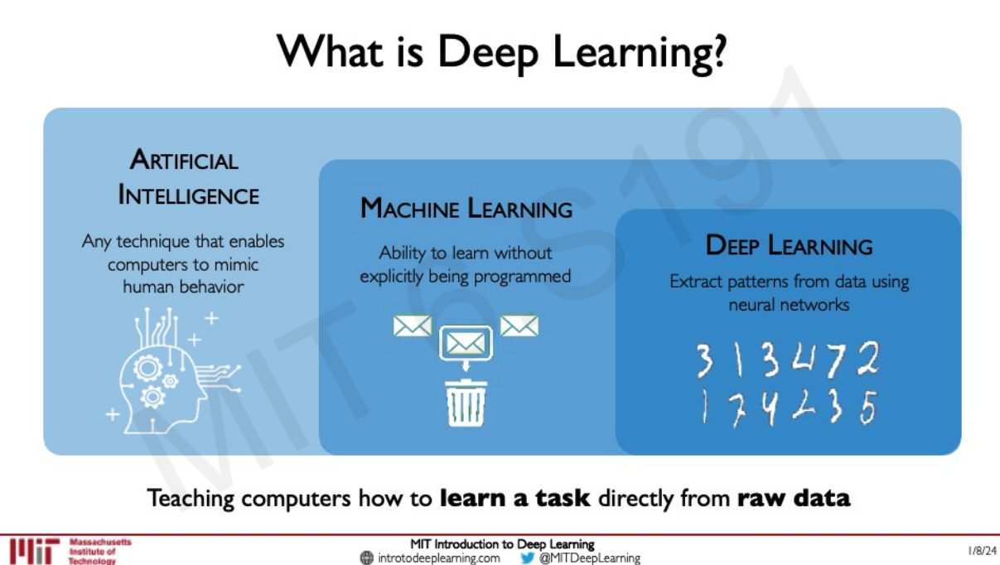

### Intelligence 
- Intelligence (I) is the ability to process information which will inform your future decision making ability "

###  Artifical Intelligence 
- AI just giving this ability to Computer

### Machine Learning 
- ML is a part of AI and it just teaching how can we get this ability instread of setting own rules.

### Deep Learning (DL)
- DL is subset of ML and it just teaching computers how to learn a task directly from row data.

