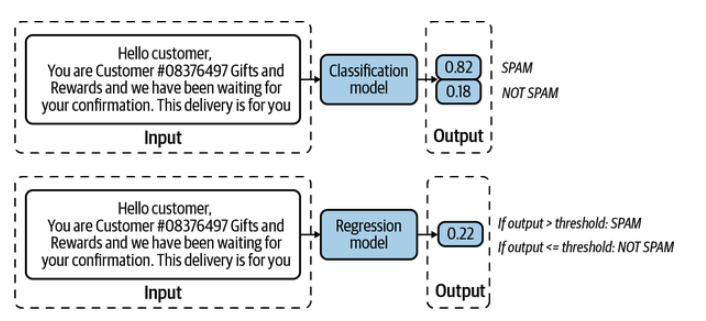
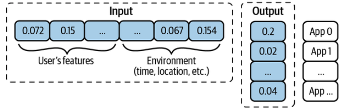
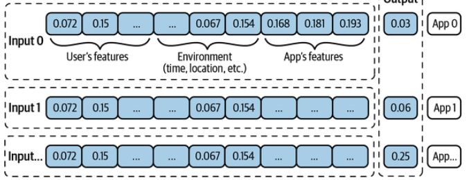

### 1. Frame to Machine Learning Problems

Developing an ML system is an iterative and, in most cases, never-ending process. Once a system is put into production, it’ll need to be continually monitored and updated.

#### ML System approach steps
1. Project Scoping
2. Data engineering
3. ML model Development
4. Deployment
5. Monitoring and continual learning
6. Business analysis

#### Types of ML System
1. Regression
2. Classification
    - 2.1  Binary
    - 2.2 Multiclass
    - 2.3 Multilabel

We can see the different between Regression and Classification with Email SPAM classification problem as follow :

တစ်ခါတလေမှာ ကျွန်တော်တို့တွေပြသနာကိုချည်းကပ်ပုံကိုအခြားတစ်နည်းနဲ့လုပ်တာပိုအဆင်ပြေတတ်ပါတယ်။

ဉပမာ။ User ကနောက်ထပ်ဘယ် App ကိုဖွင့်မလဲဆိုတာတွက်ချက်ပီး RAM ပေါ် ကြိုတင်ပေးရမယ်ဆိုပါတော့။
ကျွန်တော်တို့တွေ ဒီလိုတွေးနိုင်ပါတယ်။ 

ဒီ Case မှာက နောက်ထပ် App တွေကလည်း user က ထပ်ထည့်နိုင်တာကြောင့်၊ သေချာပေါက် ကျွန်တော်တို့ model output nodes တွေကို အရှင်ထားရမလိုဖြစ်လာတတ်ပါတယ်။ ဒါပေမဲ့ ကျွန်တော်တီု့တွေပြသနာကို ဒီလိုပြောင်းပီးတွေးလို့ရပါသေးတယ်။

### 2. Data and Data Types
data_engineering_fundamentals ထဲက Notebook တွေကို အရင်ကြည့်ပါ။
|Format| Binary/Text |Human Readable | use cases|
|------|------|------|------|
| JSON | Text|  Yes| everywhere|
| CSV| Text | Yes | everywhere|
| Parquet | Binary | No | Hadoop, Amazon Redschift|
| Avro| Binary | No | Hadoop|
| Protobuf | Binary | No | Google, Tensorflow (TFRecord)|
| Pickle | Binary | No | Python, PyTorch serialization|

####  Structured data VS Unstructured data
A repository for storing structured data is called a data warehouse. A repository for storing unstructured data is called a data lake. Data lakes are usually used to store raw data before processing. Data warehouses are used to store data that has been processed into formats ready to be used

|Structured Data| Unstructured Data |
|-----|-----|
Schema clearly defined|	Data doesn’t have to follow a schema|
| Easy to search and analyze |	Fast arrival |
| Can only handle data with a specific schema |	Can handle data from any source | 
| Schema changes will cause a lot of troubles | No need to worry about schema changes (yet), as the worry is shifted to the downstream applications that use this data | 
| Stored in data warehouses	| Stored in data lakes | 

### Labeling
Disagreements among annotators are extremely common.To minimize the disagreement among annotators, it’s important to first have a clear problem definition. For example, in the preceding entity recognition task, some disagreements could have been eliminated if we clarify that in case of multiple possible entities, pick the entity that comprises the longest substring. You need to incorporate that definition into the annotators’ training to make sure that all annotators understand the rules